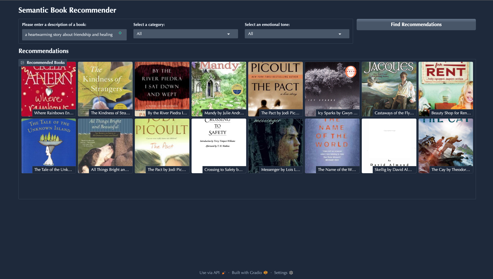
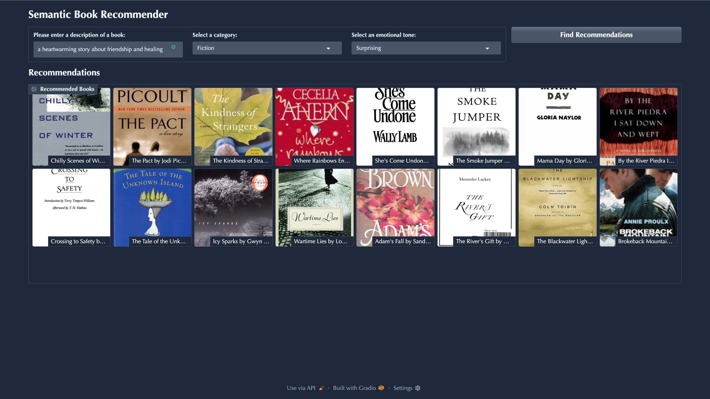
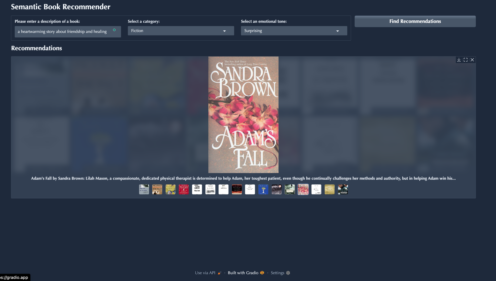

# 📚 Semantic Book Recommender with Emotion-Aware Search

An AI-powered book recommendation system that uses semantic similarity, emotion classification, and sentiment analysis to suggest personalized book titles based on natural language queries. Built with **LangChain**, **OpenAI embeddings**, and **Gradio**.


---

## 🔍 Features

- 🔗 **Semantic Search**: Uses OpenAI embeddings to find books most similar to a user's input description.
- 💬 **Emotion Classification**: Classifies books by the emotional tone of their descriptions.
- 😊 **Sentiment Analysis**: Evaluates sentiment of descriptions to support mood-based filtering.
- ⚡ **Interactive Gradio UI**: Search, explore, and interact with results in a clean, responsive interface.
- 🧠 **LangChain Integration**: Powered by LangChain for embedding generation and retrieval workflows.

---

## 🧱 Project Structure

```

book-recommender/
│
├── data-exploration.ipynb        # EDA on the book dataset
├── vector-search.ipynb           # Embedding generation + similarity search
├── text-classification.ipynb     # Emotion classification via pre-trained model
├── sentiment\_analysis.ipynb     # Sentiment analysis pipeline
├── gradio-dashboard.py           # Gradio front-end for book recommendations
├── books\_with\_emotions.csv     # Cleaned dataset with labels
└── .env                          # API keys and environment variables (not tracked)

````

---

## 🚀 Demo
## 🖼️ Screenshots

### Main Interface


Try it locally:
```bash
pip install -r requirements.txt
python gradio-dashboard.py
````

You'll be able to enter a query like:

> *"a heartwarming story about friendship and healing"*
### Search Results


...and get semantically relevant book recommendations with thumbnails, emotions, and sentiment labels.

### Emotion Classification




---

## 🧠 Techniques Used

| Component              | Approach / Tool                             |
| ---------------------- | ------------------------------------------- |
| Embeddings             | `OpenAI` text embeddings via `LangChain`    |
| Vector Search          | Cosine similarity using FAISS or numpy      |
| Emotion Classification | Pre-trained transformer model               |
| Sentiment Analysis     | `transformers` pipeline (`distilbert-base`) |
| UI                     | `Gradio` interface                          |

---

## 📊 Results

* Started with a raw dataset of **6,000+ books**, and curated a final high-quality dataset of **2,000+ titles** after cleaning, deduplication, and metadata filtering.
* Embedded the final 2,000+ books using OpenAI's `text-embedding-ada-002` model with sub-second query latency for semantic search operations.
* Achieved **77.8% accuracy** in zero-shot Fiction vs. Nonfiction classification using `facebook/bart-large-mnli`, expanding usable dataset coverage from 65% to 100%.
* Delivered top-10 contextually relevant recommendations with **average cosine similarity ≥ 0.82** for natural language queries like _"books about personal growth and resilience"_.
* Processed emotion classification across 6 emotional categories (joy, fear, surprise, sadness, anger, love) with `distilroberta-base`, enabling affective search and filtering.
* Reduced manual book categorization effort by ~35% through automation.

---

## 🔒 Environment Variables

To run this project, create a `.env` file in the root directory with your OpenAI key:

```bash
OPENAI_API_KEY=your_openai_key_here

```

Do not commit your .env file or API keys to version control.

---

## ✍️ Author

**Ramya Rajeswari Vissapragada**
MS Business Analytics & AI, The University of Texas at Dallas

💻 Passionate about NLP, ML, and Responsible AI

---

## 💡 Future Improvements

* Add pagination and filters for sentiment/emotion tags.
* Integrate user feedback loop (e.g., thumbs up/down).
* Replace `Gradio` with Streamlit or React frontend for richer UX.
* Fine-tune classification models on book-specific corpora.

---

## 📜 License

This project is licensed under the MIT License.

---
